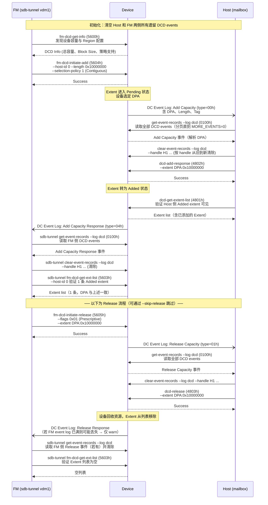
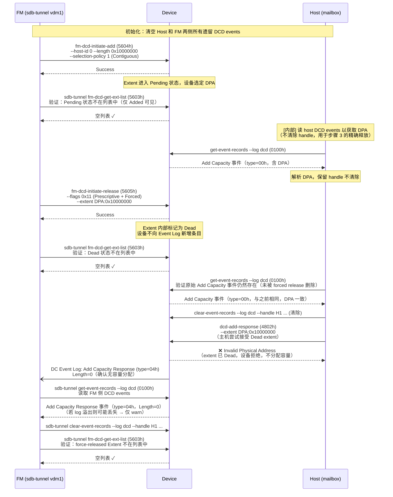

# DCD Test Cases

据 CXL 3.2 规范，动态容量设备（DCD）的容量管理主要涉及织物管理器（FM）、设备固件（Device）以及主机（Host）三方。

测试工具：`tests/mbcci-sfx-dcd-tests.sh`

测试假设：
- FM 接口：`sdb-tunnel --port vdm1`
- host-id / ldid：`0`
- Extent 大小：256 MB（`0x10000000`）
- 仅 Region 0 和 Region 1 启用

`fm-dcd-initiate-release` 的 `flags` 编码：

| bits\[3:0\] | bit\[4\] | 含义 |
|-------------|----------|------|
| 0h | 0 | Non-Prescriptive，非强制 |
| 1h | 0 | Prescriptive，非强制（Case 1 步骤 7） |
| 1h | 1 | Prescriptive + Forced Removal（Case 2 步骤 3，`0x11`） |

---

## DCD 基础概念

**Extent（范围）**：分配的基本单位，由起始 DPA 和长度组成。

**状态机**：
- **Pending**：FM 已下达 Add 请求，主机尚未确认。
- **Added**：主机已确认，容量可访问（仅此状态在 FM extent list 中可见）。
- **Dead**：Pending 状态时被 FM 强制释放，主机的 Add Response 会被设备拒绝。

---

## Case 1：Prescriptive Add / Release 完整流程

适用于非共享区域的标准容量增删，全程由 FM 以精确 Extent 控制。



### 关键校验点

| 步骤 | 校验内容 |
|------|---------|
| 步骤 3 | host 侧 DCD log 含 Add Capacity 事件（type=00h），可解析 DPA |
| 步骤 4b | `dcd-get-extent-list` 返回该 Extent（仅 Added 状态才可见） |
| 步骤 5 | FM 侧 DCD log 含 Add Capacity Response 事件（type=04h） |
| 步骤 6 | FM extent list 含 1 条已添加 Extent，DPA 与步骤 3 一致 |
| 步骤 8 | host 侧 DCD log 含 Release Capacity 事件（type=01h） |
| 步骤 11 | FM extent list 为空 |

---

## Case 2：Prescriptive Forced Release（主机确认前 FM 强制撤回）

此场景描述 FM 在主机尚未确认 Add 之前，使用 Prescriptive + Forced（`flags=0x11`）强制撤回请求，使 Extent 进入 Dead 状态。



### 关键校验点

| 步骤 | 校验内容 |
|------|---------|
| 步骤 1b | FM extent list 为空（Pending 状态不可见） |
| 步骤 3b | FM extent list 为空（Dead 状态不可见） |
| 步骤 4 | host 侧 DCD log 中 Add Capacity 事件内容与 forced release 前完全相同（设备未修改） |
| 步骤 5 | `dcd-add-response` 返回非零错误（Invalid Physical Address）—— extent 为 Dead |
| 步骤 6 | FM 侧 DCD log 含 Add Capacity Response 事件（type=04h），Length=0 |
| 步骤 7 | FM extent list 为空（Dead 项已彻底清除） |

---

## Case 3：DCD Shared Access

此场景描述 FM 使用 Prescriptive 策略为 LD0 分配容量并打 tag，可选地添加 FM 引用以持有容量，再以 Enable Shared Access 策略（`selection-policy=3`）将同一容量共享给 LD1。随后完成 LD0 释放（reference 保障容量不被回收）、FM force-release LD1 及移除引用的完整流程。

**前置条件**（运行时自动检测，不满足则 SKIP）：
- Region 0 的 Flags bit 3 = `0x08`（Sharable）

> **注意**：CXL 3.2 规范中 `fm-dcd-get-info` 的 `Capacity Selection Policies` bits\[3:0\] 定义为 Free / Contiguous / Prescriptive（bit 0–2），**bit 3 为保留位（Must be 0）**。"Enable Shared Access" 策略（selection-policy=3）不在此位域内体现，判断共享能力的唯一依据是 Region Flags 的 Sharable 位。

**tag 传递规则**：
- Prescriptive（step 4）：顶层 header tag 字段为 reserved，tag 通过 `--extent DPA:LEN:TAG` 的 per-extent tag 携带
- Enable Shared Access（step 11）：tag 通过顶层 `--tag` 参数（header tag 字段）携带，且须与 step 4 的 tag 完全一致

测试工具：`tests/mbcci-sfx-dcd-share-tests.sh`

```mermaid
sequenceDiagram
    participant FM   as FM (sdb-tunnel vdm1)
    participant Dev  as Device
    participant LD0  as LD0 (host-id=0 mailbox)
    participant LD1  as LD1 (host-id=1 mailbox)

    Note over FM,LD1: 初始化：清空 LD0 和 FM 两侧所有遗留 DCD events

    FM->>Dev: fm-dcd-get-region-config (5601h)<br/>--host-id 0 --region-cnt 2<br/>awk 提取 Region[0].Base → REGION_DPA<br/>bash 检查 Flags bit3 (Sharable=0x08)
    Dev-->>FM: Region[0]: Base=REGION_DPA, Flags=0xXX
    Note over FM: Flags bit3=1 → Sharable，继续<br/>否则 SKIP 退出

    FM->>Dev: fm-dcd-get-info (5600h)<br/>获取设备容量信息（仅展示，不做策略门控）<br/>注：Capacity Selection Policies bit3 为保留位
    Dev-->>FM: DCD Info（总容量、Block Size、支持策略等）

    FM->>Dev: fm-dcd-list-tags (5608h)<br/>基准检查（记录当前 tag 列表）
    Dev-->>FM: Tag 列表（预期为空）

    FM->>Dev: fm-dcd-initiate-add (5604h)<br/>--host-id 0 --selection-policy 2 (Prescriptive)<br/>--extent REGION_DPA:0x10000000:DCD_TAG<br/>（Prescriptive：tag 在 per-extent 字段，header tag 为 reserved）
    Dev-->>FM: Success
    Note over Dev: LD0 Extent 进入 Pending<br/>DPA = REGION_DPA（FM 已指定，无需事件解析）

    Dev-)LD0: DC Event Log: Add Capacity (type=00h)<br/>DPA = REGION_DPA

    LD0->>Dev: get-event-records --log dcd (0100h)<br/>读取 DCD events，清除 handles
    Dev-->>LD0: Add Capacity 事件
    LD0->>Dev: clear-event-records --log dcd --handle H1 ...

    LD0->>Dev: dcd-add-response (4802h)<br/>--extent REGION_DPA:0x10000000
    Dev-->>LD0: Success
    Note over Dev: LD0 Extent 转为 Added 状态

    LD0->>Dev: dcd-get-extent-list (4801h)<br/>验证 LD0 Added extent 可见
    Dev-->>LD0: Extent list（含已添加的 Extent）

    Dev-)FM: DC Event Log: Add Capacity Response (type=04h)

    FM->>Dev: sdb-tunnel get-event-records --log dcd (0100h)<br/>读取 FM 侧 DCD events，清除 handles
    Dev-->>FM: Add Capacity Response 事件
    FM->>Dev: sdb-tunnel clear-event-records ...

    FM->>Dev: fm-dcd-get-ext-list (5603h)<br/>--host-id 0 验证 1 条 Added extent
    Dev-->>FM: LD0 Extent list（DPA=REGION_DPA）

    FM->>Dev: fm-dcd-list-tags (5608h)<br/>验证 DCD_TAG 已分配
    Dev-->>FM: Tag list（含 DCD_TAG）

    Note over FM,LD1: ── 可选步骤（--skip-reference 跳过）──
    FM->>Dev: fm-dcd-add-reference (5606h)<br/>--tag DCD_TAG<br/>（持有引用：LD0 释放后容量不被回收/擦除）
    Dev-->>FM: Success

    Note over FM,LD1: ── LD1 Enable Shared Access Add ──
    FM->>Dev: fm-dcd-initiate-add (5604h)<br/>--host-id 1 --selection-policy 3 (Enable Shared Access)<br/>--tag DCD_TAG<br/>（Enable Shared Access：tag 在顶层 header 字段；Region 需为 Sharable）
    Dev-->>FM: Success
    Note over Dev: LD1 Extent 进入 Pending<br/>（Enable Shared Access 模式下设备可能自动 Added）

    FM->>Dev: fm-dcd-get-ext-list (5603h)<br/>--host-id 1（信息展示；LD1 未确认则 Pending 不可见）
    Dev-->>FM: 可能为空或含 LD1 Extent（视设备实现）

    Note over FM,LD1: ── LD0 Prescriptive Release ──
    FM->>Dev: fm-dcd-initiate-release (5605h)<br/>--host-id 0 --flags 0x01 (Prescriptive)<br/>--extent REGION_DPA:0x10000000
    Dev-->>FM: Success

    Dev-)LD0: DC Event Log: Release Capacity (type=01h)

    LD0->>Dev: get-event-records --log dcd (0100h)<br/>读取 Release 事件，清除 handles
    Dev-->>LD0: Release Capacity 事件
    LD0->>Dev: clear-event-records ...

    LD0->>Dev: dcd-release (4803h)<br/>--extent REGION_DPA:0x10000000
    Dev-->>LD0: Success
    Note over Dev: LD0 解除映射<br/>FM reference 持有容量，不会被回收

    Dev-)FM: DC Event Log: Release Response<br/>（若 FM event log 已满则可能丢失 → 仅 warn）

    FM->>Dev: sdb-tunnel get-event-records --log dcd (0100h)<br/>读取 FM Release 事件（若有），清除 handles
    Dev-->>FM: Release Response（若 log 未满）

    FM->>Dev: fm-dcd-get-ext-list (5603h)<br/>--host-id 1（信息展示；LD1 仍 Pending → 不在列表中）
    Dev-->>FM: 可能为空

    FM->>Dev: fm-dcd-list-tags (5608h)<br/>验证 tag 仍存在（reference 持有容量）<br/>（仅在 --skip-reference 未启用时执行）
    Dev-->>FM: Tag list（含 DCD_TAG）

    Note over FM,LD1: ── FM Force Release LD1 ──
    FM->>Dev: fm-dcd-initiate-release (5605h)<br/>--host-id 1 --flags 0x11 (Prescriptive + Forced)<br/>--extent REGION_DPA:0x10000000
    Dev-->>FM: Success

    FM->>Dev: fm-dcd-get-ext-list (5603h)<br/>--host-id 1 验证 extent 列表为空
    Dev-->>FM: 空列表

    Note over FM,LD1: ── 可选步骤（--skip-reference 跳过）──
    FM->>Dev: fm-dcd-remove-reference (5607h)<br/>--tag DCD_TAG<br/>（移除引用后，若无任何主机映射，容量将被回收/擦除）
    Dev-->>FM: Success

    FM->>Dev: fm-dcd-list-tags (5608h)<br/>验证 DCD_TAG 已清除
    Dev-->>FM: 空列表（或已无 DCD_TAG）
```



### 关键校验点

| 步骤 | 校验内容 |
|------|---------|
| 步骤 1 | Region[0].Flags bit3 = `0x08`（Sharable）；否则 SKIP |
| 步骤 2 | `fm-dcd-get-info` 执行成功（仅展示，无门控条件） |
| 步骤 4 | Prescriptive Add：tag 在 `--extent DPA:LEN:TAG`（per-extent）；header tag 字段为 reserved |
| 步骤 6b | `dcd-get-extent-list` 返回 LD0 已添加的 Extent（仅 Added 状态可见） |
| 步骤 8 | FM extent list 含 1 条 LD0 Added extent，DPA = REGION_DPA |
| 步骤 9 | `fm-dcd-list-tags` 显示 `DCD_TAG` 已分配 |
| 步骤 11 | Enable Shared Access Add：tag 在顶层 `--tag`（header），须与步骤 4 完全一致 |
| 步骤 12 | `fm-dcd-get-ext-list LD1` 仅展示（LD1 未确认 → Pending 不可见，可能为空） |
| 步骤 17 | `fm-dcd-get-ext-list LD1` 仅展示（LD1 仍 Pending，不在列表中） |
| 步骤 17b | 若添加了 reference：`fm-dcd-list-tags` 仍显示 `DCD_TAG`（reference 持有容量） |
| 步骤 19 | FM force-release 后，LD1 extent list 为空 |
| 步骤 21 | `fm-dcd-list-tags` 不再显示 `DCD_TAG`（所有引用和映射均已释放） |

---

## 测试脚本用法

```bash
# 运行全部用例（Case 1 含 Release 流程）
sudo ./tests/mbcci-sfx-dcd-tests.sh mem0

# 跳过 Case 1 的 Release 流程（步骤 7-11），适用于设备不同步产生 Release event 的场景
sudo ./tests/mbcci-sfx-dcd-tests.sh --skip-release mem0

# 指定 binary 路径
MBCCI_SFX=./build/tools/mbcci-sfx/mbcci-sfx sudo ./tests/mbcci-sfx-dcd-tests.sh mem0

# 运行 DCD Shared Access 测试（Case 3）
sudo ./tests/mbcci-sfx-dcd-share-tests.sh mem0

# 跳过 FM add/remove reference 步骤（步骤 10/20）
sudo ./tests/mbcci-sfx-dcd-share-tests.sh --skip-reference mem0

# 指定自定义 tag（接受任意 hex，1-32 字符，可带 0x 前缀，右对齐零填充至 16 字节）
sudo ./tests/mbcci-sfx-dcd-share-tests.sh --tag 0xdeadbeef mem0
```
